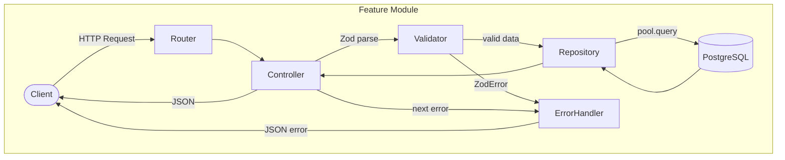

# Architecture

## Overview

Node.js/Express REST API following a layered, feature-modular structure. Each feature is a self-contained module with its own routing, validation, business logic, and data access.

---

## Diagram



---

## Layers

### Entry Point
Initializes the Express app, registers global middleware (JSON parsing, error handler), and starts the server.

### Configuration
Loads environment variables and initializes the PostgreSQL connection pool. Consumed by the rest of the application via imports.

### API Routing
A single top-level router mounts feature sub-routers by resource name (e.g. `/decks`, `/cards`).

### Feature Module
Each feature follows a consistent six-file structure:

| File | Responsibility |
|---|---|
| `router.ts` | Declares routes and maps them to controller handlers |
| `controller.ts` | Validates request input, calls repository, returns JSON response |
| `repository.ts` | Executes parameterized SQL queries against the database |
| `validator.ts` | Zod schemas — base schema + operation-specific variants |
| `types.ts` | Types inferred from Zod schemas; namespaces for operation-scoped bodies |
| `constants.ts` | `ERROR_MESSAGES` and `SUCCESS_MESSAGES` keyed constants |

### Middleware
A single global error handler intercepts all errors passed via `next(error)`:
- `ZodError` → 400 with validation details
- `AppError` (custom, carries `.status`) → uses that status
- Unhandled → 500

---

## Key Patterns

### Validation
Request bodies are parsed and validated with Zod in the controller before any repository call. Invalid input throws a `ZodError` caught by the error handler.

### Repository
All database interaction is isolated in the repository layer using parameterized queries (`$1`, `$2`, ...) for SQL injection safety. Query results are typed via `pool.query<Type>()`.

### Error Handling
Errors are propagated via Express's `next(error)`. App-level errors are created with a helper that attaches a `status` code to a standard `Error`.

### Response Shape
All endpoints return a consistent envelope:
```ts
type DefaultResponse<Data = unknown> = {
  message?: string
  data?: Data
}
```

---

## Testing Strategy

The `pg` module is mocked globally so no test hits a real database. Each feature's test file mocks its own repository module, uses `vi.hoisted` for shared fixtures, and asserts on HTTP response status, body shape, and repository call arguments via Supertest.

---

## Development Conventions

- **Commit messages**: Conventional Commits, enforced by commitlint on commit.
- **Pre-commit hooks**: format → lint → typecheck → affected tests (Lefthook).
- **Linting/Formatting**: Biome with single quotes, tabs, line width 80.
- **Path aliases**: `#src/*`, `#config/*`, `#testHelpers/*` for clean imports.
- **New modules**: follow the six-file feature pattern — use `/create-router` skill to scaffold.
